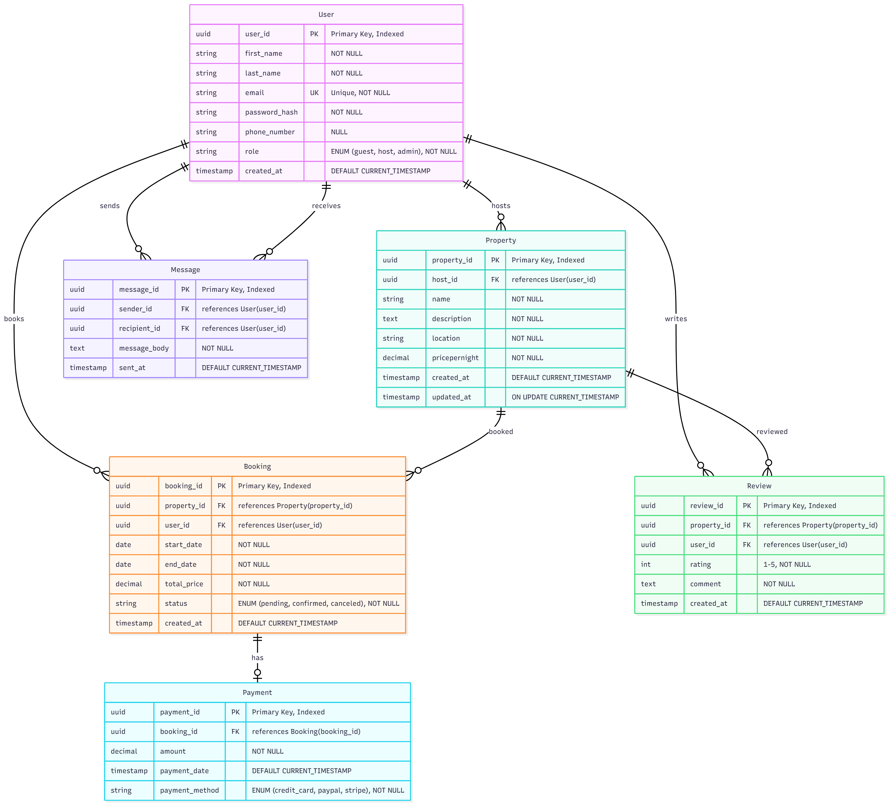

# Entity-Relationship Diagram Requirements

## Overview
This document outlines the entities, attributes, and relationships for the Airbnb database system. Use this specification to create the ER diagram in Draw.io.

## ER Diagram

---

## Entities and Attributes

### 1. User
**Purpose:** Stores information about all users in the system (guests, hosts, and admins)

| Attribute | Type | Constraints | Description |
|-----------|------|-------------|-------------|
| user_id | UUID | PRIMARY KEY, INDEXED | Unique identifier for each user |
| first_name | VARCHAR | NOT NULL | User's first name |
| last_name | VARCHAR | NOT NULL | User's last name |
| email | VARCHAR | UNIQUE, NOT NULL | User's email address |
| password_hash | VARCHAR | NOT NULL | Hashed password for security |
| phone_number | VARCHAR | NULL | User's contact number (optional) |
| role | ENUM | NOT NULL | User role: 'guest', 'host', or 'admin' |
| created_at | TIMESTAMP | DEFAULT CURRENT_TIMESTAMP | Account creation timestamp |

---

### 2. Property
**Purpose:** Stores information about properties listed on the platform

| Attribute | Type | Constraints | Description |
|-----------|------|-------------|-------------|
| property_id | UUID | PRIMARY KEY, INDEXED | Unique identifier for each property |
| host_id | UUID | FOREIGN KEY → User(user_id) | Reference to the property owner |
| name | VARCHAR | NOT NULL | Property name/title |
| description | TEXT | NOT NULL | Detailed property description |
| location | VARCHAR | NOT NULL | Property location/address |
| pricepernight | DECIMAL | NOT NULL | Nightly rental price |
| created_at | TIMESTAMP | DEFAULT CURRENT_TIMESTAMP | Property listing creation time |
| updated_at | TIMESTAMP | ON UPDATE CURRENT_TIMESTAMP | Last update timestamp |

---

### 3. Booking
**Purpose:** Stores booking/reservation information

| Attribute | Type | Constraints | Description |
|-----------|------|-------------|-------------|
| booking_id | UUID | PRIMARY KEY, INDEXED | Unique identifier for each booking |
| property_id | UUID | FOREIGN KEY → Property(property_id) | Reference to booked property |
| user_id | UUID | FOREIGN KEY → User(user_id) | Reference to user making booking |
| start_date | DATE | NOT NULL | Booking start date |
| end_date | DATE | NOT NULL | Booking end date |
| total_price | DECIMAL | NOT NULL | Total booking cost |
| status | ENUM | NOT NULL | Status: 'pending', 'confirmed', 'canceled' |
| created_at | TIMESTAMP | DEFAULT CURRENT_TIMESTAMP | Booking creation timestamp |

---

### 4. Payment
**Purpose:** Stores payment transaction details

| Attribute | Type | Constraints | Description |
|-----------|------|-------------|-------------|
| payment_id | UUID | PRIMARY KEY, INDEXED | Unique identifier for each payment |
| booking_id | UUID | FOREIGN KEY → Booking(booking_id) | Reference to associated booking |
| amount | DECIMAL | NOT NULL | Payment amount |
| payment_date | TIMESTAMP | DEFAULT CURRENT_TIMESTAMP | When payment was made |
| payment_method | ENUM | NOT NULL | Method: 'credit_card', 'paypal', 'stripe' |

---

### 5. Review
**Purpose:** Stores user reviews for properties

| Attribute | Type | Constraints | Description |
|-----------|------|-------------|-------------|
| review_id | UUID | PRIMARY KEY, INDEXED | Unique identifier for each review |
| property_id | UUID | FOREIGN KEY → Property(property_id) | Reference to reviewed property |
| user_id | UUID | FOREIGN KEY → User(user_id) | Reference to reviewing user |
| rating | INTEGER | NOT NULL, CHECK (1-5) | Rating from 1 to 5 stars |
| comment | TEXT | NOT NULL | Review text/comments |
| created_at | TIMESTAMP | DEFAULT CURRENT_TIMESTAMP | Review creation timestamp |

---

### 6. Message
**Purpose:** Stores messages between users

| Attribute | Type | Constraints | Description |
|-----------|------|-------------|-------------|
| message_id | UUID | PRIMARY KEY, INDEXED | Unique identifier for each message |
| sender_id | UUID | FOREIGN KEY → User(user_id) | Reference to message sender |
| recipient_id | UUID | FOREIGN KEY → User(user_id) | Reference to message recipient |
| message_body | TEXT | NOT NULL | Message content |
| sent_at | TIMESTAMP | DEFAULT CURRENT_TIMESTAMP | Message sent timestamp |

---

## Relationships

### User ↔ Property
- **Type:** One-to-Many (1:N)
- **Description:** A user (as host) can own multiple properties
- **Foreign Key:** Property.host_id → User.user_id

### User ↔ Booking
- **Type:** One-to-Many (1:N)
- **Description:** A user (as guest) can make multiple bookings
- **Foreign Key:** Booking.user_id → User.user_id

### Property ↔ Booking
- **Type:** One-to-Many (1:N)
- **Description:** A property can have multiple bookings
- **Foreign Key:** Booking.property_id → Property.property_id

### Booking ↔ Payment
- **Type:** One-to-One (1:1)
- **Description:** Each booking has one associated payment
- **Foreign Key:** Payment.booking_id → Booking.booking_id

### User ↔ Review
- **Type:** One-to-Many (1:N)
- **Description:** A user can write multiple reviews
- **Foreign Key:** Review.user_id → User.user_id

### Property ↔ Review
- **Type:** One-to-Many (1:N)
- **Description:** A property can have multiple reviews
- **Foreign Key:** Review.property_id → Property.property_id

### User ↔ Message (Sender)
- **Type:** One-to-Many (1:N)
- **Description:** A user can send multiple messages
- **Foreign Key:** Message.sender_id → User.user_id

### User ↔ Message (Recipient)
- **Type:** One-to-Many (1:N)
- **Description:** A user can receive multiple messages
- **Foreign Key:** Message.recipient_id → User.user_id

---

## Indexing Strategy

### Primary Indexes (Automatic)
- User.user_id
- Property.property_id
- Booking.booking_id
- Payment.payment_id
- Review.review_id
- Message.message_id

### Additional Indexes (Performance Optimization)
- User.email (for login queries)
- Property.property_id (for faster property lookups)
- Booking.property_id (for property availability queries)
- Booking.booking_id (for payment association)

---

## Notes for Draw.io ER Diagram

1. **Entity Representation:**
   - Use rectangles for entities
   - List all attributes inside each entity
   - Underline primary keys
   - Mark foreign keys with (FK)

2. **Relationship Lines:**
   - Use crow's foot notation for cardinality
   - Label relationships clearly
   - Show one-to-many and one-to-one relationships

3. **Visual Organization:**
   - Place User entity centrally (it connects to most tables)
   - Group related entities (Booking and Payment close together)
   - Keep the diagram clean and readable

4. **Cardinality Notation:**
   - One side: Single line
   - Many side: Crow's foot (three lines)
   - Use appropriate symbols for mandatory/optional relationships